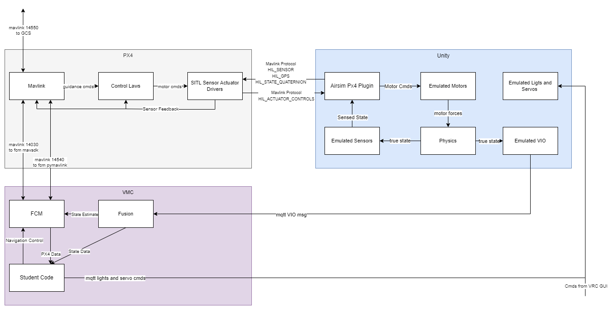

# VRC 2022 Simulation

This Repository hosts the Unity project for the VRC 2022 simulation.

## Architecture

This simulation is currently designed to run all on a local development computer. A high level architecture diagram is shown below. 


A more detailed diagram of how the VRC flight software interacts with the simulation is shown below



We are also working to make this simulation web based. The goal of this architecture will be to allow all of the students to participate in the software development of the drone with minimal installation required. The client side requirements will be as follow

- Browser connection to server
- Qgroundcontrol (optional)
    - joystick connected to QGC for rc control (optional)
- VRC GUI (optional)

a high level architecture diagram is shown for this configuration below as well. 


## Pre-Reqs

This project uses the Airsim plugin to communicate between unity and the PX4 flight stack. In order to do development please download and build unity as described [here](https://microsoft.github.io/AirSim/Unity/)

Install the PX4 toolchain as described [here](https://docs.px4.io/v1.12/en/dev_setup/dev_env_windows_cygwin.html)

clone [VRC-2022](https://github.com/bellflight/VRC-2022) and checkout `sim-dev`

cd `VMC\FlightSoftware\mqtt` and run 
```
docker build -t sim-mqtt .
```

## Importing the Project

To import, simply open unity hub, click impoort and select the top level folder of this project. 

## Running Simulation

Run mqtt broker
```
docker run -it --rm --add-host=host.docker.internal:host-gateway --name sim-mqtt -p 18830:18830 flightsoftware_mqtt 
```

Run Unity Sim from Unity Editor

Run Px4 
- navigate to `C:\PX4`
- double click `run-console.bat`
- change directories to px4 firmware `cd PX4-Autopilot/`
- run PX4 sitl `make px4_sitl_default none_iris`

## Known Issues

the px4 slight stack briefly looses connection with Airsim. I think this is related to this issue. https://github.com/PX4/PX4-Autopilot/issues/16234

This might not be an issue if sim is ran on linux. 
